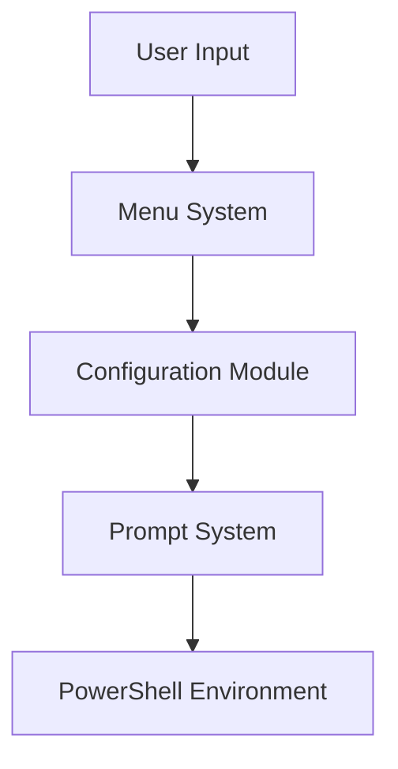

# PSProfile Menu Configuration System

## Overview
The PSProfile Menu Configuration system provides an interactive interface for managing various aspects of PSProfile, including prompt customization, feature management, and system settings.

## Components

### PromptMenu Module
The `PromptMenu` module (`PromptMenu.psm1`) provides comprehensive prompt configuration capabilities:

- **Prompt Type Selection**
  - Switch between Starship and PSProfile prompts
  - Dynamic prompt reloading
  - Configuration persistence

- **Starship Configuration**
  - Config file path management
  - Cache location settings
  - Direct config file editing

- **PSProfile Prompt Settings**
  - Git status integration
  - Path display options
  - Timestamp configuration
  - Color scheme customization

### Menu Integration
The configuration system integrates seamlessly with the main PSProfile menu system, providing:

- Consistent user interface
- Intuitive navigation
- Real-time configuration updates
- Configuration validation

## Usage

### Accessing the Configuration Menu
1. Open PowerShell
2. Run `Import-Module PSProfile`
3. Execute `Show-PSProfileMenu`
4. Select "Prompt Configuration"

### Configuration Options

#### Prompt Type
- Switch between Starship and PSProfile prompts
- Automatic configuration validation
- Seamless prompt reloading

#### Starship Settings
- Configure Starship paths
- Edit Starship configuration
- Manage cache settings

#### PSProfile Prompt
- Toggle features:
  - Git status display
  - Path information
  - Time display
- Customize colors:
  - Path color
  - Git status color
  - Error message color

## Architecture

### Dependencies
- PSProfile Core Configuration Module
- PowerShell 5.1+
- Starship (optional)

### Configuration Flow


### File Structure
```
UI/
└── Menu/
    └── Config/
        ├── PromptMenu.psm1    # Prompt configuration module
        ├── PromptMenu.psd1    # Module manifest
        └── README.md          # This documentation
```

## Development

### Adding New Configuration Options
1. Add configuration keys to `Configuration.psm1`
2. Create corresponding menu items in `PromptMenu.psm1`
3. Update validation and persistence logic
4. Add documentation

### Best Practices
- Use dependency injection for configuration management
- Maintain separation of concerns
- Implement proper error handling
- Provide user feedback for all actions
- Ensure configuration persistence
- Validate all user inputs

## Error Handling
- Configuration validation
- Path existence checks
- Color scheme validation
- Graceful fallback options

## Future Enhancements
- Additional prompt customization options
- Theme presets
- Configuration import/export
- Backup and restore functionality
- Cross-platform compatibility improvements

## Contributing
1. Fork the repository
2. Create a feature branch
3. Implement changes
4. Add tests
5. Submit a pull request

## License
See the main PSProfile license file.

## Related Documentation
- [PSProfile Main Documentation](../../README.md)
- [Configuration System](../../Core/Configuration/README.md)
- [Prompt System](../Prompt/README.md)
